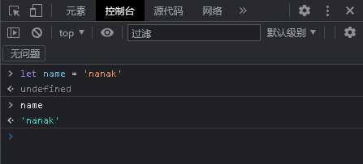

# <center>JS中的变量及其类型<center>

### <p align="right">时间：2023-3-4</p>
### <p align="right">Abraham nanak</p>

请保证你读完了前面的文章，如果没有的话请返回JS简介读一遍。

## 读完本文你能学会什么？

你将学会以下的内容：

* 变量是什么
* 如何声明变量
* 初始化变量
* var和let的区别
* 更新变量
* 变量的命名规则
* 变量的类型
* typeof操作符

## 变量是什么？

一个变量就是用来存储数据的容器，你可以把它想象成一个盒子。它里面可以放一些东西，你也可以把里面的东西拿出来放别的东西进去，看一个简单的例子。

`<button>Press me</button>`// html

```javascript
const button = document.querySelector('button');

button.onclick = function() {
  let name = prompt('What is your name?');
  alert('Hello ' + name + ', nice to see you!');
}
```

在上面的例子中，点击按钮之后，第一行代码会在屏幕上弹出一个对话框，让你输入名字，然后存储输入的名字到一个变量。第二行代码将会显示包含你名字的欢迎信息，你的名字就是从之前的变量里面读取的。效果如下


变量的另一个特性就是它们能够存储任何的东西–不只是字符串和数字。变量可以存储更复杂的数据，甚至是函数。你将在后续的内容中体验到这些用法。

我们说，变量是用来存储数值的，那么有一个重要的概念需要区分。变量不是数值本身，它们仅仅是一个用于存储数值的容器。你可以把变量想象成一个个用来装东西的纸箱子。


## 声明变量

使用变量之前需要先声明变量，声明一个变量的语法是在 var 或 let 关键字之后加上这个变量的名字：`var name` 或`let name` 

那么现在尝试输入这些代码到你的浏览器的控制台


然后你将得到两个undefined（未定义的），这是因为你现在只是声明了一个变量，但它里面什么都没有。（你现在有一个盒子里面并没有任何东西）

误区：“一个变量存在，但是没有数值”和“一个变量并不存在” — 他们完全是两回事 — 在前面你看到的盒子的类比中，不存在意味着没有可以存放变量的“盒子”。没有定义的值意味着有一个“盒子”，但是它里面没有任何值。

## 初始化变量

声明一个变量之后，你就可以对它进行初始化操作。

像这样`name = "nanak"`

现在在console里实现一下吧



你也可以将声明变量和初始化写成一句，就像上面一样。现在你就可以使用这个变量做很多事情了。

## var和let的区别

此时，您可能会想：“为什么我们需要两个关键字来定义变量？”，“为什么有 var 和 let 呢？"。

原因是有些历史性的。回到最初创建 JavaScript 时，是只有 var 的。在大多数情况下，这种方法可以接受，但有时在工作方式上会有一些问题——它的设计会令人困惑或令人讨厌。因此，let 是在现代版本中的 JavaScript 创建的一个新的关键字，用于创建与 var 工作方式有些不同的变量，解决了过程中的问题。

如果你使用var 声明一个变量并且初始化这个变量，然后又用同样的名字重新声明。这样是不会报错的，而let则会报出一个错误，如下图。


let来说这显然是不合理的，因为没有理由重新声明变量——这只会让事情变得更加混乱。

这只是其中之一，其他原因你可以自行查找


注意：出于这些以及其他原因，我们建议您在代码中尽可能多地使用 let，而不是 var。因为没有理由使用 var，除非您需要用代码支持旧版本的 Internet Explorer (它直到第 11 版才支持 let ，现代的 Windows Edge 浏览器支持的很好)。

## 更新变量

一旦变量赋值，您可以通过简单地给它一个不同的值来更新它。试试在你的控制台中输入`name = ‘Hello’` ，再次打印结果如下。


## 关于变量命名的规则

你可以给你的变量赋任何你喜欢的名字，但有一些限制。一般你应当坚持使用拉丁字符 (0-9,a-z,A-Z) 和下划线字符。

* 你不应当使用规则之外的其他字符，因为它们可能引发错误，或对国际用户来说难以理解。
* 变量名不要以下划线开头—— 以下划线开头的被某些 JavaScript 设计为特殊的含义，因此可能让人迷惑。
* 变量名不要以数字开头。这种行为是不被允许的，并且将引发一个错误。
* 一个可靠的命名约定叫做 "小写驼峰命名法"，用来将多个单词组在一起，小写整个命名的第一个字母然后大写剩下单词的首字符。我们已经在文章中使用了这种命名方法。
* 让变量名直观，它们描述了所包含的数据。不要只使用单一的字母/数字，或者长句。
* 变量名大小写敏感——因此myage与myAge是 2 个不同的变量。
* 最后也是最重要的一点—— 你应当避免使用 JavaScript 的保留字给变量命名。保留字，即是组成 JavaScript 的实际语法的单词！因此诸如 var、function、let 和 for 等，都不能被作为变量名使用。浏览器将把它们识别为不同的代码项，因此你将得到错误。

## JS数据类型

可以为变量设置不同的变量类型，目前为止我们用的一直是字符串String型。接下来继续介绍JS中的数据类型。

### Number

JS不同其他的编程语言，如C语言。不论是整型还是浮点型，在JS里面都是Number你给变量赋值一个数字时时，不需要用引号括起来，它就是Number 类型。

`let age = 18`

### String

我们在上面已经见过像`name = 'nanak'` 这样的语句，字符串是文本的一部分。当你给一个变量赋值为字符串时，你需要用单引号或者双引号把值给包起来，否则 JavaScript 将会把这个字符串值理解成别的变量名。

### Boolean

Boolean 的值有 2 种：true 或 false。Boolean类型的变量通常用来指示一种状态，真 or 假。

`let isHot = false`

`let isCool = true`

### Array

数组是一个单个对象，其中包含很多值，方括号括起来，并用逗号分隔。尝试在您的控制台输入以下行：

`let myNameArray = ['Chris', 'Bob', 'Jim']` 

现在你有了一个数组，数组的名字是`myNameArray` ，你可以通过“数组名[索引值]”的方式来访问数组，如下图。


注意：你可能已经注意到了，索引值是从0开始计数的，而不是1。

与其他语言不同的是，由于JS是一个动态类型的语言，JS的数组不用包括同一种数据类型，参见下图。你甚至可以再存入一个数组（数组中的数组）。


### Object

在编程中，对象是现实生活中的模型的一种代码结构。您可以有一个简单的对象，代表一个停车场，并包含有关其宽度和长度的信息，或者您可以有一个代表一个人的对象，并包含有关他们的名字，身高，体重，他们说什么语言，如何说 你好，他们，等等。

尝试在您的控制台输入以下行：

`let dog = { name : 'Spot', breed : 'Dalmatian' }`

要检索存储在对象中的信息，可以使用以下语法：

`dog.name`


动态类型和弱类型

JavaScript 是一种“动态类型语言”，这意味着不同于其他一些语言 (译者注：如 C、JAVA)，您不需要指定变量将包含什么数据类型（例如 number 或 string）

例如，如果你声明一个变量并给它一个带引号的值，浏览器就会知道它是一个字符串：`let myString = 'Hello'`

即使它包含数字，但它仍然是一个字符串，所以要小心：

```javascript
let myNumber = '500'; // oops, this is still a string
typeof myNumber;
myNumber = 500; // much better — now this is a number
typeof myNumber
```

尝试依次将上述代码输入您的控制台，看看结果是什么（无须输入//之后的注释）。我们使用了一个名为`typeof`的特殊的操作符 ——它会返回所传递给它的变量的数据类型。第一次在上面的代码中调用它，它应该返回 string，因为此时 `myNumber` 变量包含一个字符串'500'。看看它第二次将返回什么。


注意：观察`typeof`使用的方式

JavaScript 也是一个弱类型语言，这意味着当操作涉及不匹配的类型是否，它将允许隐式类型转换，而不是抛出一个错误。

```javascript
const foo = 42; // foo is a number
const result = foo + "1"; // JavaScript coerces foo to a string, so it can be concatenated with the other operand
console.log(result); // 421
```

强制隐式转换是非常方便的，但是如果开发者不打算转换，或者打算向另一个方向转换（例如，字符串转数值而不是数值到字符串），则会存在潜在的隐患。对于 symbol 和 BigInt，JavaScript 总是不允许某些隐式类型转换。

注意上面的数据类型做一个总结

以上只是做了一个简单的介绍，包括一部分的数据类型

在面试的时候，有时会问你一个比较基础的问题。

JS里面的变量有多少种？分别是什么？

答案有很多，我们来说一个标准的答案：

答：JS里的数据类型有八种，可分为两类，分别是：

* 原始类型
  * null
  * undefined
  * number
  * string
  * boolean
  * Symbol
  * BigInt

* 引用类型
  * Object

这是后你可能会疑惑：`Symbol`和`BigInt`是什么？Array和function去了哪里？

简单介绍一下`Symbol`：`Symbol` 是唯一并且不可变的原始值并且可以用来作为对象属性的键（如下）。在某些程序语言当中，Symbol 也被称作“原子类型”（`atom`）。`symbol` 的目的是去创建一个唯一属性键，保证不会与其它代码中的键产生冲突。

简单介绍一下`BigInt`：`BigInt` 类型在 `Javascript` 中是一个数字的原始值，它可以表示任意大小的整数。使用 `BigInt`，你可以安全地存储和操作巨大的整数，甚至超过 `Number` 的安全整数限制。

那么Array和function去了哪里？


在计算机科学中，对象（`object`）是指内存中的可以被标识符引用的一块区域。在 JavaScript 中，对象是唯一[可变 (en-US)](https://developer.mozilla.org/zh-CN/docs/Web/JavaScript/Data_structures)的值。事实上，[函数](https://developer.mozilla.org/zh-CN/docs/Web/JavaScript/Reference/Functions)也是具有额外可调用能力的对象，综上所述，`Array`和`function` 归类于`Object` 

本文依据于MDN具有一定权威性

See [MDN docs](https://developer.mozilla.org/zh-CN/docs/Web/JavaScript/Data_structures)