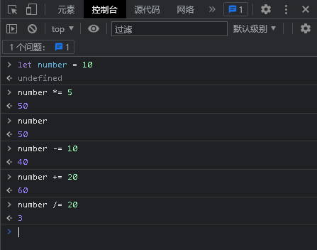
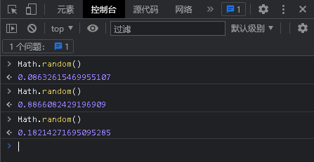
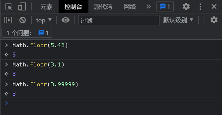

# 
JS中的数学计算及其运算符

### 
时间：2023-3-4

### 
Abraham nanak

现在你已经会使用变量存储值了，接下来我们将使用运算符来操作数字完成一些任务。

## 本文你能学会什么？

读完本文你将学会以下内容：

* 在JS中数字类型的分类
* 算术运算符
* 运算符优先级
* 自增自减运算符
* 赋值运算符
* 比较运算符
* JS中的Math对象操作

## 数字类型的分类

在计算机中，我们可以把数字分成以下几类：

* 整数 就是整数，例如 10, 400, 或者 -5.
* 浮点数 (浮点) 有小数点或小数位，例如 12.5，和 56.7786543。
* 双精度双精度是一种特定类型的浮点数，它们具有比标准浮点数更高的精度（这意味着它们精确到更大的小数位数）。

我们甚至有不同类型的数字系统！十进制是基数 10（意味着它在每列使用 0-9），但是我们也有这样的东西：

* 二进制 — 计算机的最基础语言—— 0 和 1，使用0b开头来表示二进制数，如0b11、0b111
* 八进制 — 基数 8，每列使用 0-7。使用0开头来表示八进制数，如041、054、078
* 十六进制 — 基数 16，每列使用 0-9，然后使用 a-f。使用0x开头来表示16进制，如0x44、0x88

幸运的是在JS中我们不用这些复杂的表示，我们只要记住一个东西就好了，它就是`Number` ,如下图所演示一般。

## 算数运算符

算术运算符用来做一些基本的运算、加减乘除、取余、幂运算。

算术运算符是我们用来做和的基本运算符：

| 运算符 | 名称                  | 作用                                                         | 示例                                                |
| :----- | :-------------------- | :----------------------------------------------------------- | :-------------------------------------------------- |
| `+`    | 加法                  | 两个数相加。                                                 | `6 + 9`                                             |
| `-`    | 减法                  | 从左边减去右边的数。                                         | `20 - 15`                                           |
| `*`    | 乘法                  | 两个数相乘。                                                 | `3 * 7`                                             |
| `/`    | 除法                  | 用右边的数除左边的数                                         | `10 / 5`                                            |
| `%`    | 求余 (有时候也叫取模) | 在你将左边的数分成同右边数字相同的若干整数部分后，返回剩下的余数 | `8 % 3` (返回 2，8 除以 3 的倍数，余下 2。)         |
| `**`   | 幂                    | 取底数的指数次方，即指数所指定的底数相乘。它在 `EcmaScript` 2016 中首次引入。 | `5 ** 5` (返回 3125，相当于 `5 * 5 * 5 * 5 * 5` 。) |

你可以在你的浏览器的控制台中尝试一下。

注意：你以后有时候会看到参与算术计算的数字被称为 操作数 (operands )

## 运算符的优先级

让我们来看看下面的表达式的结果是多少

`4 + 5 *  7 / 3`

先算4 + 5等于9 ，9 * 7等于63，63 / 3等于21？

No，正确结果如下图。

我知道这简单的运算是难不到你的，可是我还是要讲。

这是因为运算符优先级 —— 一些运算符将在计算算式（在编程中称为表达式）的结果时先于其他运算符被执行。JavaScript 中的运算符优先级与学校的数学课程相同 - 乘法和除法总是先完成，然后是加法和减法（总是从左到右进行计算）。

如果想要改变计算优先级，可以把想要优先计算的部分用括号围住。所以要得到结果为 21，我们可以这样做：

## 自增和自减运算符

有时候我们想要将一个变量的值加一或者减一然后存回变量，我们可以这样做。假设`let age = 18 `。

`age = age + 1`

这样是可以完成任务的，让我们来分析一下发生了什么。

1. 首先取出age的值
2. age + 1 = 19
3. 产生这个副本19
4. 将副本赋值给age

其实有一种更简便的方式那就是自增运算符，它有增量（++）和递减（ -- ）两种运算符，分别来完成自增和自减操作。它们分别还有两种形式前缀和后缀的形式。如下图.

我们发现了一个规律，前缀形式的情况下是先自增（自减）后进行运算。后缀形式则是先运算后自增（自减）。

注意：在编码的时候要注意前缀和后缀形式的不同，否则将造成不容易查找的错误。

那么我们来分析一下，他做了什么：

1. 首先取出a
2. a的值+1
3. 存回a

你发现了他比`age = age + 1` 少了一个步骤，所以它的效率高一点。

## 赋值运算符

赋值运算符是将值存进变量的运算符，我们已经见过一个“=”了，它就是赋值运算符。接下来我们继续介绍。

| 运算符 | 名称     | 作用                                           | 示例              | 等价于               |
| :----- | :------- | :--------------------------------------------- | :---------------- | :------------------- |
| `+=`   | 加法赋值 | 右边的数值加上左边的变量，然后再返回新的变量。 | `x = 3; x += 4;`  | `x = 3; x = x + 4;`  |
| `-=`   | 减法赋值 | 左边的变量减去右边的数值，然后再返回新的变量。 | `x = 6; x -= 3;`  | `x = 6; x = x - 3;`  |
| `*=`   | 乘法赋值 | 左边的变量乘以右边的数值，然后再返回新的变量。 | `x = 2; x *= 3;`  | `x = 2; x = x * 3;`  |
| `/=`   | 除法赋值 | 左边的变量除以右边的数值，然后再返回新的变量。 | `x = 10; x /= 5;` | `x = 10; x = x / 5;` |

你可以在控制台中试一试，尝试理解他们的工作方式

**注意：这些运算符的左边只能是变量。**

## 比较运算符

有时，我们将要运行真/假测试，然后根据该测试的结果进行相应的操作 - 为此，我们使用比较运算符。

| 运算符 | 名称       | 作用                           | 示例          |
| :----- | :--------- | :----------------------------- | :------------ |
| `===`  | 严格等于   | 测试左右值是否相同             | `5 === 2 + 4` |
| `!==`  | 严格不等于 | 测试左右值是否**不**相同       | `5 !== 2 + 3` |
| `<`    | 小于       | 测试左值是否小于右值。         | `10 < 6`      |
| `>`    | 大于       | 测试左值是否大于右值           | `10 > 20`     |
| <=     | 小于或等于 | 测试左值是否小于或等于右值。   | `3 <= 2`      |
| >=     | 大于或等于 | 测试左值是否大于或等于正确值。 | `5 >= 4`      |

为什么没有和`==`和`!=`？你可能会看到有些人在他们的代码中使用`==`和`!=`来判断相等和不相等，这些都是 JavaScript 中的有效运算符，但它们与`===/!==`不同，前者测试值是否相同，但是数据类型可能不同，而后者的严格版本测试值和数据类型是否相同。严格的版本往往导致更少的错误，所以我们建议您使用这些严格的版本。

如果您尝试在控制台中尝试一下，您将看到它们都返回 true/false 值

## JS中的Math对象操作

Math是JS中的一个常用的内置对象，当我们进行数学计算时，使用起来很方便，下面我们将简单介绍它的使用。

## Math中的方法

### `Math.random()`

这个方法可以返回一个0（包括）-1（不包括）之间的随机数

### Math.floor(x)

这个方法返回一个小于等于x的最大整数（向下取整）。

注意：它不会返回超过x的数，如3.9999 它将返回3

使用Math.random()和Math.floor()产生随机数

我们可以使用这两个方法产生一个随机数，random()方法返回一个0-1之间的数，我们将这个数乘以x，然后把它传入floor()取整就可以返回一个0-(x-1)之间的随机一个数。

### Math.ceil(x)

ceil() 方法可对x进行上舍入(向上取整)。如果参数是一个整数。

注意：ceil方法只要大于x就返回floor(x + 1)的值

### Math.abs(x)

该方法可以返回x的绝对值

### Math.round()

round() 方法可把一个数字舍入为最接近的整数（四舍五人）

### Math.pow()

pow() 方法返回 x 的 y 次幂

`Math.pow(2,3)//结果是8`

### `Math.sqrt()`

sqrt() 方法可返回一个数的算数平方根。

`Math.sqrt(4)//结果是2`

### `Math. cbrt()`

cbrt()方法可返回一个数的立方根。

Math.cbrt(8)//结果是2

Math.cbrt(-8)//结果是-2

### Math.sin()

sin()函数返回一个数值的正弦值，单位是弧度制的。

Math.sin(Math.PI / 2)//结果是1

### Math.cos()

cos()函数返回一个数值的余弦值。

Math.cos(Math.PI * 2)//结果是1

### Math.tan()

tan()函数返回一个数值的正切值。

Math.tan(45Math.PI/180)//0.9999999999999999 

### Math.max()

max(n1,n2,n3,...,nX) 方法可返回两个或多个指定的数中带有较大的值的那个数。

tip：参数可为一个或多个值。在 ECMASCript v3 之前，该方法只有两个参数。

Math.max(1,2)//2 Math.max(1,2,3,11)//11

### Math.min()

min(n1,n2,n3,...,nX) 方法可返回指定的数字中带有最小值的数字。

tip：参数可为一个或多个值。在 ECMASCript v3 之前，该方法只有两个参数。

Math.min(3,6)//3 Math.min(1,23,5)//1

## Math中的常量

### Math.PI

一个常量PI，它的值对应数学中的π

### Math.E

欧拉常数，也是自然对数的底数，约等于 2.718。

### Math.LN2

2 的自然对数，约等于 0.693。

### Math.LN10

10 的自然对数，约等于 2.303。

### Math.LOG2E

以 2 为底的 E 的对数，约等于 1.443。

### Math.LOG10E

以 10 为底的 E 的对数，约等于 0.434。

### Math.SQRT1_2

二分之一 ½ 的平方根，同时也是 2 的平方根的倒数 12，约等于 0.707。

### Math.SQRT2

2 的平方根，约等于 1.414。

注意：Math 用于 Number 类型。它不支持 `BigInt`。

注意： 需要注意的是，三角函数 `sin()、cos()、tan()、asin()、acos()、atan()` 和 `atan2()` 返回的值是_弧度_而非角度。若要转换，弧度除以 (`Math.PI / 180`) 即可转换为角度，同理，角度乘以这个数则能转换为弧度。

注意：很多 Math 函数都有一个精度，而且这个精度在不同实现中也是不相同的。这意味着不同的浏览器会给出不同的结果，甚至，在不同的系统或架构下，相同的 JS 引擎也会给出不同的结果！

上面介绍了一些简单的常量和方法，详细请看MDN Math对象