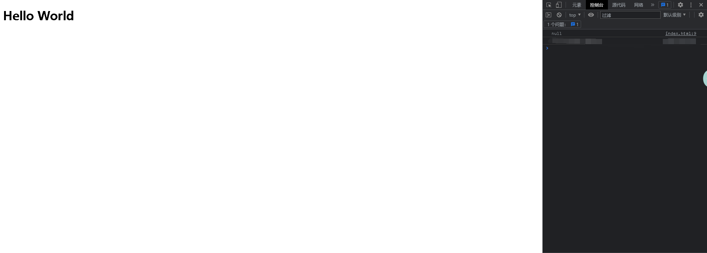
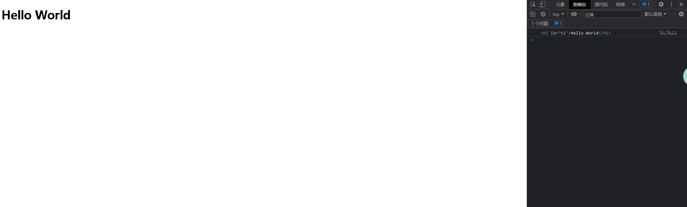
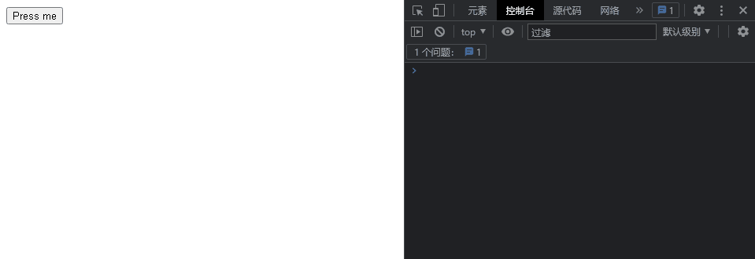

# <center>JS的敲门砖</center>

### <p align="right">时间：2023-3-4</p>
### <p align="right">Abraham nanak</p>

看完前两个文档你对JS有了一定的了解，你现在已经知道了：

* JS是什么？

* JS可以做什么？

* JS的发展历史及其版本

* JS的组成

* 浏览器渲染过程是怎么样的？

  并且配置好了IDE并且成功完成了“Hello World”示例。不过还需要了解点前置的知识：

* HTML（超文本标记语言）
	
	超文本标记语言（HTML）是你用来组织你的网络内容，并赋予它意义和目的的代码。例如，我的内容是一组段落还是一个要点列表？我的页面上是否插入了图片？我有一个数据表吗？
	
* CSS（层叠样式表）

  是你用来为你的网站设置样式的代码。例如，你希望文本是黑色还是红色？内容应该画在屏幕的什么地方？应该用什么背景图片和颜色来装饰你的网站？

  

## 本文的内容

在本文你将学会以下内容：

* 如何向页面加入JS代码
* 脚本调用策略
* JS的注释

然后我将带你体验一下JS，循序渐进地构建一个简易版“猜数字”游戏。然后继续介绍以下内容

* JS的编程范式
* JS输出与输入

开始之前转赠你们一段话：

> “工作马马虎虎，只想在兴趣和游戏中寻觅快活，充其量只能获得一时的快感，决不能尝到从心底涌出的惊喜和快乐，但来自工作的喜悦并不像糖果那样——放进嘴里就甜味十足、而是需要从劳苦与艰辛中渗出。因此当我们聚精会神、孜孜不倦、克服艰辛后达到目标时的成就感，世上没有那种喜悦可以类比。  更何况人类生活中工作占据了较大的比重，如果不能从劳动中、工作中获得充实感，那么即使从别的地方找到快乐，最终我们仍然会感到空虚和缺憾。”  ——稻盛和夫先生《活法》

## 如何向页面中加入JS代码
你已经知道了HTML控制结构，CSS控制样式，JS就是控制逻辑的。

可以像添加 CSS 那样将 JavaScript 添加到 HTML 页面中。CSS 使用 `<link>` 元素链接外部样式表，使用 `<style>` 元素向 HTML 嵌入内部样式表，JavaScript 这里只需一个元素`<script>`。我们来看看它是怎么工作的。

JS主要有三种使用方式：内部的JS，外部的JS，内联的JS

### 内部JS

这种方式有点像CSS，首先使用`<script>`把JS代码包裹起来，然后插入到head之中，建议插入到head结束标签之前，像这样。

```html
<head>
    <meta charset="UTF-8">
    <meta http-equiv="X-UA-Compatible" content="IE=edge">
    <meta name="viewport" content="width=device-width, initial-scale=1.0">
    <title>Title</title>
    <script>
        //这里写JS
    </script>
</head>
```


### 外部JS

外部JS的方式是常用的，首先将JS代码保存到一个文件之中它的后缀是".js"，这表示它是一个JS文件，之后像外部CSS样式一样使用`<script src="js文件">`将JS与HTML关联，如下。

```html
<body>
    <script src="js文件"></script>
</body>
```

与内部JS不同，外部的JS的`<script>`位于body最后，且在body结束标签之前

现在我们把 JavaScript 写进了一个外部文件。这样做一般会使代码更加有序，更易于复用，且没有了脚本的混合，HTML 也会更加易读，因此这是个好的习惯。

### 内联JS

内联的JS是不推荐使用的，因为他会破坏HTML的结构，这样阅读起来很困难，而且效率低下。它有点像这样。

```html
<button onclick="createParagraph()">点我呀</button>
```

引号里面是一个函数的调用，onclick是一个监听的事件。当点击onclick的时候就会调用createParagraph(），这种调用的方式有一个形象的名字“事件驱动”。

## 脚本调用策略

你可能会好奇，为什么内联和外部的JS它们的`<script>`放置的位置不同。这实际上和执行顺序有关。head中的JS代码在页面加载之前就会加载，因此它适合做一些初始化操作。而放在body中的JS代码，会在整个页面加载完成之后读取。

所以我们来分析一下什么时候放在head中，什么时候放在body中？

考虑以下代码

```html
<!DOCTYPE html>
<html lang="en">
<head>
    <meta charset="UTF-8">
    <meta http-equiv="X-UA-Compatible" content="IE=edge">
    <meta name="viewport" content="width=device-width, initial-scale=1.0">
    <title>Title</title>
    <script>
        i = 0
        while(i<100000)
        {
            i++;
            console.log("OK")
        }
    </script>
</head>
<body>
    <h1>Hello World</h1>
</body>
</html>
```

我们已经提到了JS的代码位于head会在页面加载之前执行。如果里面有很多代码且很复杂的逻辑页面就会很卡顿。以上代码，是在页面加载之前在控制台打印100,000次OK，实际测试的时候卡的不能动。

接着来看以下代码

```html
<!DOCTYPE html>
<html lang="en">
<head>
    <meta charset="UTF-8">
    <meta http-equiv="X-UA-Compatible" content="IE=edge">
    <meta name="viewport" content="width=device-width, initial-scale=1.0">
    <title>Title</title>
    <script>
        console.log(document.getElementById('h1'))
    </script>
</head>
<body>
    <h1 id="h1">Hello World</h1>
    
</body>
</html>
```

这段代码的意思是，获取id为h1的元素，然后打印到控制台。思考一下，位于head中的JS在页面渲染之前被加载，这个时候是没有id为h1这个元素的，所以结果如下。



误区：不要认为内部JS才会在head中，而外部JS一定在body最后。

下面示例中使用了 JavaScript 的一项现代技术（async “异步”属性）来解决这一问题，它告知浏览器在遇到 `<script>` 元素时不要中断后续 HTML 内容的加载。

```html
<!DOCTYPE html>
<html lang="en">
<head>
    <meta charset="UTF-8">
    <meta http-equiv="X-UA-Compatible" content="IE=edge">
    <meta name="viewport" content="width=device-width, initial-scale=1.0">
    <title>Title</title>
    <script src=js.js async></script>
    //js.js里面只有一句代码：console.log(document.getElementById('h1'))
</head>
<body>
    <h1 id="h1">Hello World</h1>
    
</body>
</html>
```

结果如下，正常打印。



注意：内部JS的方式使用async属性是无效的（经测试）

## async 和 defer

上述的脚本阻塞问题实际有两种解决方案 —— async 和 defer。我们来依次讲解。

浏览器遇到 async 脚本时不会阻塞页面渲染，而是直接下载然后运行。这样脚本的运行次序就无法控制，只是脚本不会阻止剩余页面的显示。当页面的脚本之间彼此独立，且不依赖于本页面的其它任何脚本时，async 是最理想的选择。

比如，如果你的页面要加载以下三个脚本：

```html
<script async src="js/vendor/jquery.js"></script>

<script async src="js/script2.js"></script>

<script async src="js/script3.js"></script>
```

三者的调用顺序是不确定的。jquery.js 可能在 script2 和 script3 之前或之后调用，如果这样，后两个脚本中依赖 jquery 的函数将产生错误，因为脚本运行时 jquery 尚未加载。

解决这一问题可使用 defer 属性，脚本将按照在页面中出现的顺序加载和运行：

```html
<script defer src="js/vendor/jquery.js"></script>
<script defer src="js/script2.js"></script>
<script defer src="js/script3.js"></script>
```

添加 defer 属性的脚本将按照在页面中出现的顺序加载，因此第二个示例可确保 jquery.js 必定加载于 script2.js 和 script3.js 之前，同时 script2.js 必定加载于 script3.js 之前。

### 脚本调用策略小结：

* 如果脚本无需等待页面解析，且无依赖独立运行，那么应使用 async。
* 如果脚本需要等待页面解析，且依赖于其它脚本，调用这些脚本时应使用 defer，将关联的脚本按所需顺序置于 HTML 中。

## 注释

就像 HTML 和 CSS，JavaScript 代码中也可以添加注释，浏览器会忽略它们，注释只是为人类提供关于代码如何工作的指引。注释非常有用，而且应该经常使用，尤其在大型应用中。注释分为两类：

在双斜杠后添加单行注释，比如：

`// 我是一条注释`

在 /* 和 */ 之间添加多行注释，比如：

`/*  我也是  一条注释 */`

## 简易版“猜数字”游戏。

现在，你已经学到了一些 JavaScript 的理论知识，以及用 JavaScript 能够做些什么。下面我会提供一个创建简单的 Javascript 程序的实践的教程——循序渐进地构建一个简易版“猜数字”游戏。

现在并不要求你立刻完整理解所有代码：你不需要借此学会 JavaScript，甚至不需要理解我们要求你编写的全部代码。当前只是概括地介绍一些抽象的概念，让你了解 JavaScript 的特性是如何协同工作的，以及获得编写 JavaScript 的一些感受。所有具体特性将在后续文章中详细介绍，如果你没有很快地全部理解它们，请不要担心！

**思考一下怎么做？**

首先我们要获取一个用户输入，我们用number这个变量来接收一下吧。然后你需要生成一个随机数，然后对比玩家输入，如果正确那么就提示”成功“，如果错误提示”失败“

### 简单的实现

```html
<!DOCTYPE html>
<html lang="en">

<head>
    <meta charset="UTF-8">
    <meta http-equiv="X-UA-Compatible" content="IE=edge">
    <meta name="viewport" content="width=device-width, initial-scale=1.0">
    <title>Demo</title>
</head>

<body>
    <div id="root">
        <!-- 首先写好html -->
        <h1>Welcome to this game</h1>
        <h2>Please enter number:</h2>
        <input id='input' type="number" @keyup.enter="submit" v-model.enter="text">
        <h2>You entered {{text}}, press Enter</h2>
        <h2 v-if="isOk">The correct answer is {{n}}</h2>
    </div>

    <!-- 外部js 这里是vue-->
    <script src="js/vue.js"></script>

    <script>
        const vm = new Vue({
            data: {
                text: 0,
                n: 0,
                isOk: false
            },
            methods: {
                submit() {
                    //生成100以内随机数
                    this.n = Math.floor(Math.random() * 100)
                    this.isOk = true
                    if (this.text === this.n) {
                        alert('You Win')
                    }
                    else {
                        alert('You lose')
                    }
                }
            },
        }).$mount('#root')

        vm.$watch('text', function () {

        })
    </script>
</body>

</html>
```

在这里使用了一个Vue框架更快的构建这个示例，你看不懂也没关系，这里就像咱们上面思考的一样。

## JS的编程范式

### 编程范式是什么？

编程范式是指软件工程中的一类典型的编程风格，它决定了程序员对程序执行的看法。不同的编程范式有不同的优缺点，适用于不同的场景。

JS是一种多范式语言，它支持以下几种编程范式：

* 命令式
* 函数式（属于声明式）
* 面向对象

目前先记住这三种就好了，接下来文章会详细介绍。

## JS中的输入与输出

JS中的输出方式先来介绍三种：

* console.log()

  在控制台打印

* alert()

  弹窗打印
  
* document.write()

  在页面中输出

JS中的输入方式介绍一种：

* prompt()

演示一下



