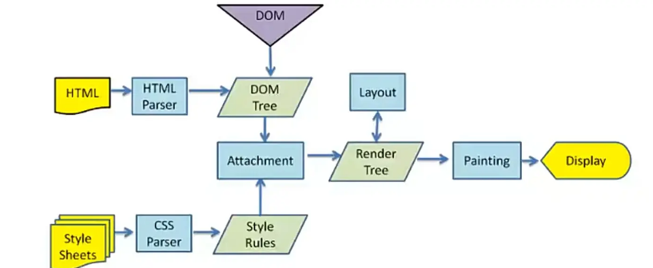

# <center>JS起步</center>

### <p align="right">时间：2023-3-4</p>
### <p align="right">Abraham nanak</p>

[TOC]


## JavaScript到底是什么？

JavaScript缩写JS，是一门完备的动态编程语言。它应用于HTML文档时，可以为网站添加动态交互的特性。

JavaScript的应用场合非常的广泛，简单到幻灯片、照片库、浮动布局和响应按钮点击，复杂到游戏、2D/3D动画、大型数据库驱动程序等等。

JavaScript是简洁的，但是却是异常强大的，它十分灵活，开发者们基于JavaScript建立了壮大的生态，其中包括：

* 浏览器应用程序接口（Web API）——浏览器内置的API提供了丰富的功能，比如动态创建HTML和设置CSS样式、从用户的摄像头采集处理视频流、生成3D图像与音频样本等。
* 第三方的APi——让开发者可以在自己的站点之中集成其他内容提供者的功能。
* 第三方的框架和库——快速地构建网站和应用。

## “Hello World”示例

首先来看看如何在页面中添加一个JS脚本来构造一个“Hello World”示例。你不用明白具体代码的含义，只需明白，浏览器会解释并执行位于 和 之间的 JavaScript 代码

1. 首先写一个基本的HTML5文档，代码如下。

   ```javascript
   <!DOCTYPE html>
   <html lang="en">
   <head>
       <meta charset="UTF-8">
       <meta http-equiv="X-UA-Compatible" content="IE=edge">
       <meta name="viewport" content="width=device-width, initial-scale=1.0">
       <title>Title</title>
   </head>
   <body>
       
   </body>
   </html>
   ```

2. 然后创建一个JS脚本文件，他的后缀是".js"，然后在里面输入

   ```javascript
   console.log("Hello World")
   ```

3. 现在在HTML里面用script标签的src属性将js脚本文件关联起来，代码如下。

   <script src="js文件"></script> 

4. 现在我们已经完成了代码的编写，用浏览器打开这个HTML文件，点击F12打开“开发者工具（developer tools）”，点击控制台（console）就会看到里面有一句话打印在里面。

   ``` 
   Hello World
   ```

现在你已经完成了“Hello World”示例了，如果你是第一次学JS这门语言你一定有很多的问题。不用担心，我们接下来会逐步为你解惑。

注意：那些老旧的实例可能会在 标签中使用 type="text/javascript"。现在已经不必这样做了。JavaScript 是所有现代浏览器以及 HTML5 中的默认脚本语言。

## 准备好你的开发环境

运行JS的成本是很低的，JS是一门解释型编程语言这与C语言这样的编译型语言不同（C语言需要编译器进行编译），我们仅仅需要一个JS引擎（JS解释器）。

常见的JavaScript引擎，有如下几个:

* SpiderMonkey：第一款JavaScript引擎，由Brenden Eich(即JavaScript作者)
* Chakra：微软开发，用于IE浏览器
* JavaScriptCore：WebKit中的JavaScript引擎，Apple公司开发
* V8：Google开发的强大JavaScript引擎，也帮助Google Chrome从众多浏览器中脱颖而出

JS引擎是内置在浏览器之中的，所以你不用准备任何运行JS的环境。

浏览器渲染过程是怎么样的？

1. 加载html，将HTML文件转成DOM树
2. 执行过程中，HTML解析的时候遇到了JavaScript标签，会停止解析HTML，而去加载和执行JavaScript代码
3. 加载并解析css，生成Style Rules
4. 将Style Rules 与 DOM Tree相结合
5. 通过布局引擎形成Render Tree
6. 绘制、展示



IDE的选择

> 工欲善其事必先利其器

JS IDE我推荐两个：WebStorm和VScode。

### WebStorm

WebStorm首先介绍一下这个IDE：WebStorm 是一个适用于 JavaScript 和相关技术的集成开发环境。类似于其他 JetBrains IDE，它也会使您的开发体验更有趣，自动执行常规工作并帮助您轻松处理复杂任务。WebStrom的开发团队号称它是最智能的 JavaScript IDE。实际体验也是不错的。

实际体验过后，优点如下：

1. 跨平台。
2. 专注开发
3. 使用简单，不用配置
4. 自动补全代码、检测错误和冗余并提供修复建议，以及帮助您安全地重构代码。
5. 内建工具用于debug。使用 WebStorm 调试和测试您的客户端和 Node.js 应用，并利用版本控制。充分使用 linter、构建工具、终端和 HTTP 客户端，这些均已经与 IDE 集成。
6. 自定义代码片段容易
7. 团队开发的功能好评
8. 快速导航和搜索

WebStorm的内存占用会大一些，但是体验比较好。

附上官网链接：[WebStorm中文官网](https://www.jetbrains.com/zh-cn/webstorm/)

### VScode

全名Visual Studio Code，是一款由微软开发且跨平台的免费源代码编辑器。 该软件支持语法高亮、代码自动补全（又称IntelliSense）、代码重构功能，并且内置了命令行工具和Git 版本控制系统。

它的优点是：

1. 跨平台。支持Windows, Linux和MacOS。
1. 体积小。完整的安装包（版本1.41)只有56M，比很多流行的手机软件都要小；
1. 运行快。在5年前的大多数电脑上都能运行的飞快；官方说的的硬件要求是1.6GHz的处理器和1G的内存就可以跑起来了。
1. 功能强。默认支持JavaScript和TypeScript语言的开发，具有丰富的快捷键，及易用的界面；
1. 扩展多。默认自带的功能不够用？通过自带的扩展库可以很快地从不计其数的扩展程序里找到自己需要的，非常容易；
1. 免费。

附上官网：[Visual Studio Code](https://code.visualstudio.com/)

### 推荐插件

VScode插件：[VScode前端插件推荐](https://zhuanlan.zhihu.com/p/57389333)

WebStorm插件：[Webstorm插件推荐](https://zhuanlan.zhihu.com/p/263897515)