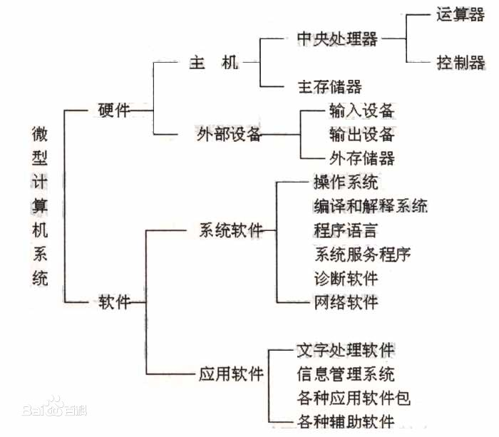

# 
1.1 计算机概述
### 
时间：2023-1-29

### 
Abraham nanak

## 需要掌握以下内容
* 【了解】公认的第一台电子计算机
* 【掌握】计算机发展的四个阶段
* 【了解】ENIAC的两大缺点
* 【掌握】ENIAC的主要特点
* 【掌握】计算机系统的组成
* 【掌握】计算机软件的分类
## 第一台计算机
目前公认的第一台电子数字计算机是ENIAC，它于1946年在美国宾夕法尼亚大学研制成功。

根据计算机本身采用的物理器件不同,将其发展为4个阶段:
* 电子管计算机时代（1946年到20世纪50年代后期）
* 晶体管计算机时代（20世纪50年代后期到20世纪60年代中期）
* 中小规模集成电路计算机时代（20世纪60年代中期到20世纪70年代初期）
* 大规模和超大规模集成电木计算机时代（20世纪70年代初期至今）
## 计算机体系结构
ENIAC有两个缺点：
1. 没有存储器
2. 用布线接板的方式进行控制，电路连接烦琐。

因此以美国匈牙利数学家冯·诺依曼为首的研发制作小组在1946年提出了“存储程序控制”的思想，并开始研制存储程序控制的计算机（EDVAC）。1951年、EDVAC问世。

EDVAC的主要特点如下：
1. 在计算及内部、程序和数据采用二进制数表示。
2. 程序和数据存放在存储器中，即采用程序存储的概念。计算机执行程序时，无需人工干预，能自动、连续地执行程序，并得到预期的结果。
3. 计算机硬件由运算器、控制器、存储器、输入设备及输出设备五大基本部件组成。
直到今日，计算机基本结构的设计仍采用冯·诺依曼提出的思想和原理，人们把符合这种设计的计算机称为“冯·诺依曼机”。冯·诺依曼也被誉为“现代电子计算机之父”。
## 计算机系统基本组成
计算机系统由硬件系统和软件系统两部分组成。

此图来自百度百科
 

硬件系统是借由电、磁、光、机械等原理构成的各种物理部件的有机集合，是计算机系统赖以工作的实体。硬件系统也称为裸机，裸机只能识别0，1组成的二进制机器代码。

软件系统是为运行、管理和维护计算机系统编制的各种程序、数据及文档的总称。软件是计算机的核心，没有软件的计算机毫无意义。软件是用户与硬件之间的接口，用户可以通过软件使用计算机硬件上的数据信息资源。
