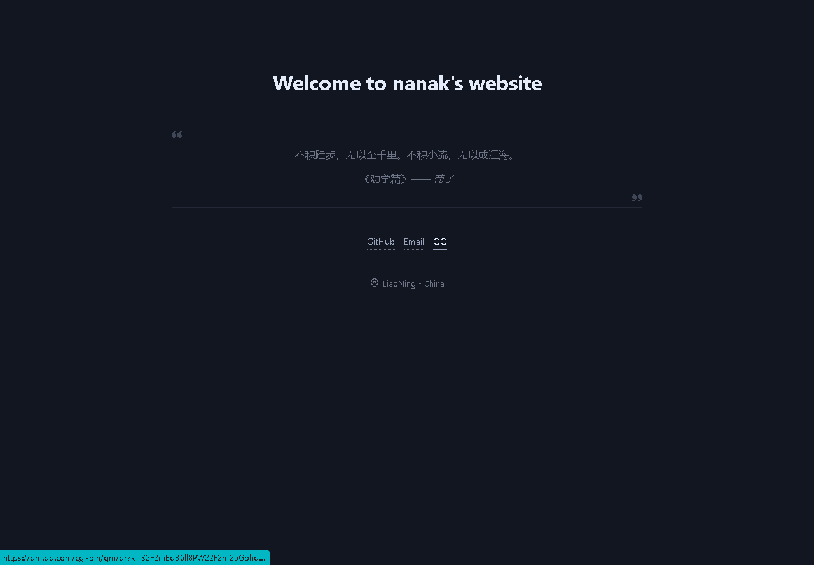

# 
从0开始创建一个个人博客网站

## 前言
你是否想拥有一个个人博客来分享知识？奈何对于网站搭建一窍不通？不用担心接下来跟这我一步一步搭建一个个人博客网站。
1. 首先访问[github.io](https://github.io)查看帮助来搭建一个网站。
   1. 首先在github创建一个仓库，仓库地址的形式是username.github.io，其中username要和自己的github用户名一致，否则无效。
   2. 之后克隆这个仓库
    > git clone https://github.com/username/username.github.io 
   3.  接着写一个index.html这个将作为主页被访问
    >cd username.github.io
    >
    >echo "Hello World" > index.html
   4. 将更改提交到远程仓库
    >git add --all
    >
    >git commit -m "Initial commit"
    >
    >git push -u origin main
   5. 初始化访问（测试），打开浏览器访问[https://username.github.io](https://username.github.io)
   
   若出现Hello World则说明你已经搭建成功了。如果没有的话，请等待一会，再刷新。
2. 接着找到一个开源项目[iissnan](https://github.com/iissnan/iissnan.github.com)，作为主页。安装比较麻烦不过是值得的。感谢作者。

   
    >稍微改一下就可以了

大概这个样子
